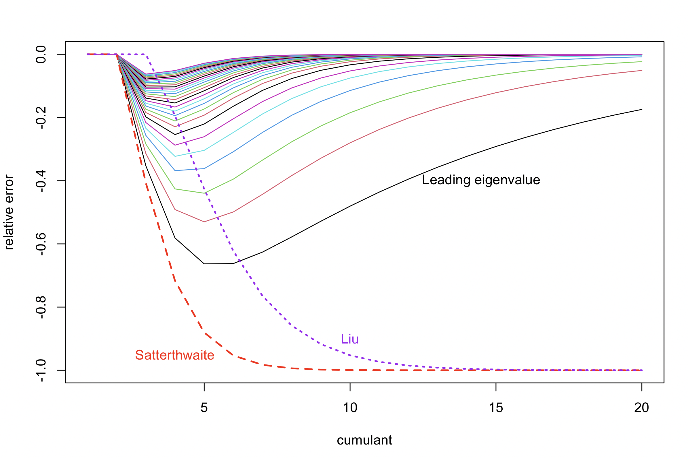

The distribution of a $n\times n$ quadratic form in Gaussian variables, $X^TAX$ is a linear combination of $\chi_1^2$ variables:
$$Q\sim\sum_{i=1}^n\lambda_iZ^2_i$$
where $\lambda_i$ are the eigenvalues of $A\Xi$ and $\Xi$ is the covariance matrix of $X$. This is not in the tables at the back of the book. 

For reasonable values of $n$ and reasonable tail probabilities, the Satterthwaite approximation is perfectly reasonable. It is of the form
$$\tilde Q_0\sim a\chi^2_d$$
where
$$a=\frac{\sum_{i=1}^n\lambda_i^2}{\sum_{i=1}^n \lambda_i}$$
is a sort of average $\lambda$ and
$$d=\frac{\left(\sum_{i=1}^n\lambda_i\right)^2}{\sum_{i=1}^n \lambda_i^2}$$
is a sort of effective sample size. The Satterthwaite approximation matches the mean and variance of $Q$.

We were interested, though, in genomic applications where $n$ was unreasonably large and we wanted quite small tail probabilities.  The Satterthwaite approximation is not good in the tails: the relative error grows exponentially as you move out into the tail. 

When $n$ is large, it matters whether you are given $\lambda$ or $A\Xi$ or something even prior to $A
\Xi$.  If you just have $\lambda$, you can use a saddlepoint approximation, or there are various algorithms for computing the tail probabilities to arbitrary accuracy (if you have arbitrary precision to work with).

There are two other approaches to approximations.  The first is to approximate more moments than just two. For example, [Liu *et al*](https://www.sciencedirect.com/science/article/pii/S0167947308005653) use a scaled non-central $\chi^2$ to  match the first three cumulants^[the $m$th cumulant, like the $m$th moment, is the expected value of an $m$th-order polynomial, and if you don't know which polynomial you probably don't care] and gets the fourth either correct or close.  The second approach is to do the first few terms of the sum and use the Satterthwaite approximation for the remainder
$$\tilde Q_k\sim \sum_{i=1}^k\lambda_iZ_i^2+a_k\chi^2_{d_k}$$
with $$a_k=\frac{\sum_{i=k+1}^n\lambda_i^2}{\sum_{i=k+1}^n \lambda_i}$$
and
$$d_k=\frac{\left(\sum_{i=k+1}^n\lambda_i\right)^2}{\sum_{i=k+1}^n \lambda_i^2}.$$

I'm going to use an example that I've used before, a simulated genomic example from the `bigQF` package. There's a $4028\times 4028$ matrix with  3336 non-zero eigenvalues. 

This picture shows the first few cumulants of the full sum, the Satterthwaite approximation, the Liu approximation, and the leading-term approximations, with the vertical axis indicating the relative error
{width=95%}

The Satterthwaite approximation underestimates the higher cumulants badly: a $\chi^2_d$ has much lighter tails than the weighted sum of $\chi^2_1$, because the tail of the weighted sum is dominated by the terms with larger $\lambda$.  The Liu approximation is much better, but eventually underestimates for the same reason.  The leading-term approaches have the opposite problem: they get the higher cumulants right, but underestimate the the first few, the skewness and kurtosis, and so on. 

How does this compare for the tail probabilities?

{width=95%}

On the horizontal axis we have the number of standard deviations above the mean, and on the vertical axis the relative error of the approximations to the tail probability. The leading-term approximations have the number of terms in the right margin. 

The Satterthwaite approximation is bad in the tails. The Liu approximation is actually very good -- you need to go a long way out into the tail before it gets bad -- but it shows the same qualitative pattern of getting worse as the tail probabilities get smaller.  The leading-term approximations get broadly^[not uniformly better, which I think is due to rounding of the $\chi^2$ degrees of freedom to an integer somewhere down in the code] better with more terms, as you'd expect. It shows the qualitative pattern of settling down towards a bounded relative error.

That is, we can think of the Liu approximation as improving the Satterthwaite approximation from the middle of the distribution out, and the leading-term approximation as improving it from the tails in. With 20 terms the leading-term approximation is better than the Liu approximation, but not with just a few terms.

Which should we prefer? Well, if we are just given $\lambda$ then Liu *et al*'s approximation is much faster to compute than a good leading-term approximation and also faster than the full saddlepoint approximation, so unless you care about the extremely extreme tails it looks like a good bet.  On the other hand, if we are just given $A\Xi$, Liu's method requires the trace of $(A\Xi)^4$. Working this out is no faster for large $m$ than working out all the eigenvalues.  Working out the first $k$ eigenvalues^[with a Lanczos-type algorithm or stochastic SVD] and the Satterthwaite approximation to the remainder takes only $O(m^2k)$ time, so (for suitable $k$) it's faster and  more accurate.