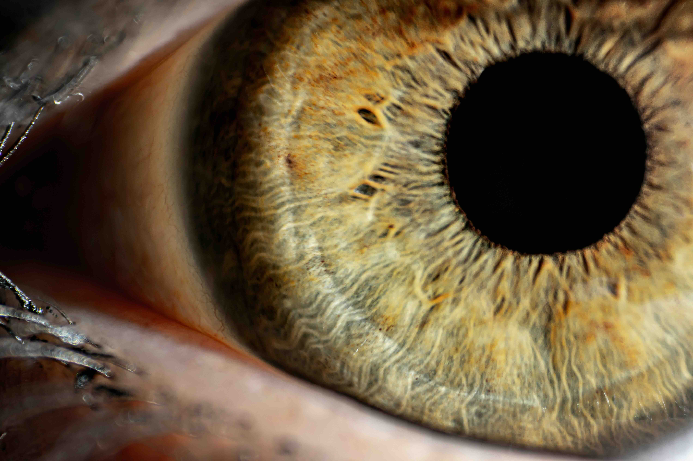
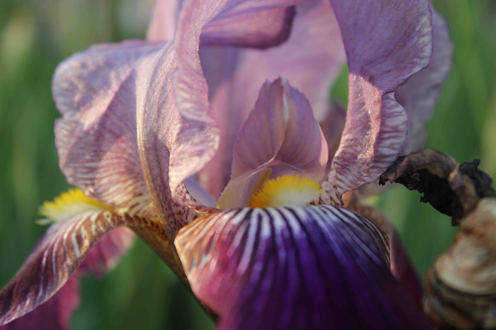

The file `iris_data.csv` contains some data on iris photographs from unsplash.org. For each of 28 photos we have the mean luminance, chroma, and hue and the standard deviation of luminance, chroma, and hue, based on converting from RGB to polar Lab coordinates with the `colorspace` package.  I haven't included the actual photo files because they're a bit big, but here are a couple of the photos at lower resolution.

{width=90%}
{width=90%}

We want to classify these images of irises into two groups. As a task, this matches what we do in the classic data set; it isn't what the photographs are for, and it is entirely pointless. 

So, first, lets look at a pairs plot of the variables

```{r fig.path='static', out.width="90%"}
iris_data<-read.csv("~/iris_data.csv",row.names=1)
pairs(iris_data[,1:6],pch=19)
```

The clusters aren't all that obvious; let's add the group variable


```{r fig.path='static', out.width="90%"}
iris_data<-read.csv("~/iris_data.csv",row.names=1)
pairs(iris_data[,1:6],pch=19,col=ifelse(iris_data[,7],"blue","orange"))
```


We're getting some separation, but not perfect separation with any pair of variables. Try principal components


```{r fig.path='static', out.width="90%"}
pc<-princomp(iris_data[,1:6])
pairs(pc$scores[,1:4],pch=19,col=ifelse(iris_data[,7],"blue","orange"))
```
It looks like component 1 is good for most of the separation, but that the next three aren't much use. Of course, principal components are unsupervised, so we can use advanced supervised learning techniques instead

```{r out.width="90%", fig.path="static"}
l<-MASS::lda(eye~.,data=iris_data)
p<-predict(l)$posterior
hist(p[,1])
table(pred=p[,1]>0.5,true=iris_data$eye)
```

And we get nearly perfect classification (at least in terms of apparent error)

On this special day, I want to finish by thanking the people who sent their iris photos to Unsplash

```{r}
t(sapply(strsplit(rownames(iris_data),"-"),"[",1:2))
```

