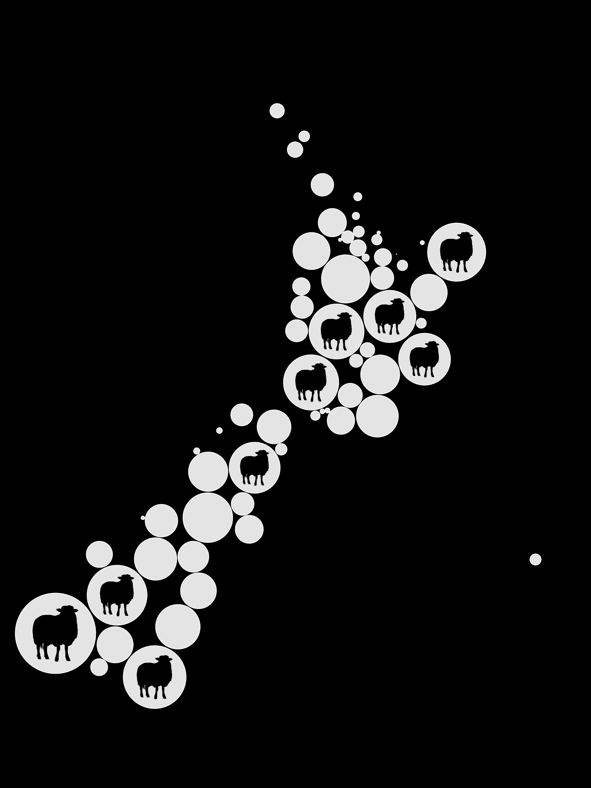

The 2025 Ihaka Lectures are coming, in September this year.  The theme is "Patterns in Space"^[yes:  Patterns **in** **S P A A A C E**] and we have two speakers, both talking (in part) about how modern computing environments and open-source software improve the research and communication of spatial modellers.

The lectures will be on the University of Auckland in the Science building (Building 303, Princes St at Wellesley St), with the lecture starting at 6pm preceded by refreshments. The official university page will be [here](https://www.auckland.ac.nz/en/science/about-the-faculty/department-of-statistics/ihaka-lecture-series.html), with a link to register for the (free) tickets closer to the event^[It's currently showing last year's programme].  The lectures will also be streamed on the internet^[starting 6pm NZST (UTC+12)] and will be made available on YouTube afterwards.

#### September 4: Dan Exeter

Dan is a health geographer. He's a Professor in the School of Population Health here in Auckland, interested in geospatial approaches to investigate health inequities.

*Today’s computational capacity, combined with a global network of open-source developers designing graphs, glyphs, maps and infographics, provides endless opportunities to communicate patterns hidden within tabular data.*

#### September 11: Adrian Baddeley

Adrian is a leading researcher in the modelling of spatial point patterns. He is Emeritus Professor of Statistics at Curtin University in Western Australia. 

*Following the best traditions of statistical science, R made it possible to develop statistical ideas hand-in-hand with software which applied and tested the ideas. Previously insurmountable barriers were progressively overcome. Even abstract concepts of point process theory became accessible when represented as interactive graphical displays in R.*

