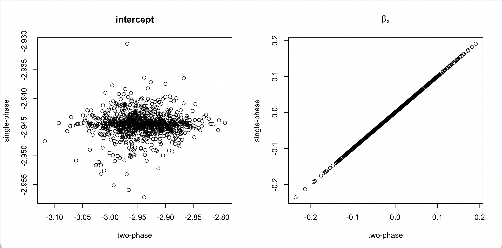

As I have said before, the distinction between multistage and multiphase surveys is mostly important as a [shibboleth](https://www.biblegateway.com/passage/?search=Judges%2012%3A5-6&version=NIV) for survey statisticians.   

The two=phase quantities $$\pi_i^*=P(i\text{ sampled}|\text{phase 1})P(i\in\text{phase 1})$$
are not the same as the marginal sampling probabilities 
$$\pi_i=P(i\text{ sampled})$$
but one uses them in exactly the same formulas, so the difference doesn't matter all that much. 

It would still be somewhat interesting to know whether using $1/\pi_i^*$ as weights is better or worse than using $1/\pi_i$ -- usually there isn't any choice, because $\pi_i$ aren't available in a multiphase sample, but interesting in theory.

We can answer this question for nested case-control sampling (and frequency-matched nested case-control sampling). This is a very special case of two-phase sampling, so the answer is less interesting, but the problem is more tractable, at least in simulation. 

Imagine we have a cohort of size $N$ that's either a simple random sample or Poisson sample from a very large population or an iid realistation from a data-generating process. A rare disease with prevalence $p$ is observed in this cohort, giving us a binary outcome variable $Y$.  We take a subsample of the $n$ people with $Y=1$ and $n$ of the people with $Y=0$ and measure $X$ on them. 

The two-phase analysis says the subsampling probability for controls is $n/(N-n)$: there are $N-n$ people with $Y=0$ and we sample $n$ of them. This is a random variable, because $n$ is random (it's the sum over the cohort of $Y$). We could also work out the marginal subsampling probability for controls, which is the expected value of $n/(N-n)$. Strictly speaking, this is infinite because there's an infinitesimal chance than $n=N$. We're going to ignore that approximate the expected value by $Np/(N-Np)$.  

Suppose we do the two-phase analysis with the phase-two probability $n/(N-n)$ and the single-phase analysis with the true marginal probability $Np/(N-Np)$. We should get unbiased pseudoscore equations either way, and effectively unbiased estimators of the regression coefficients.  How will the standard errors compare? There are basically three possibilities

- the two-phase analysis is better (because it conditions on the realised $n$)
- the one-phase analysis is better (because there's isn't variation in $\pi_i$)
- they are the same, because the case-control setting is too simple to learn anything
 
I ran a simulation, with $N=10^4$, $p=0.05$ and standard Normal $X$, and used logistic regression to model $Y|X$. For the coefficient of $X$ the two approaches gave essentially identical results. For the intercept the means were the same but there was much less variability with the one-phase analysis.

{width=80%}

The estimated standard errors matched the simulation standard errors pretty well: for the intercept, the single-phase analysis gave a reduction in the standard error by a factor of about twenty, with no change for the coefficient of $x$.  

This isn't all that exciting: we know the intercept is weird in case-control logistic regression, and we do in fact have a very good phase-one estimate of the prevalence of $Y=1$.  It's still a bit interesting in that it's a tractable example showing that the two analysis approaches can differ. The same sort of phenomenon will happen for the coefficients of matching variables in frequency-matched logistic regression for the same reason; they are basically intercepts.  